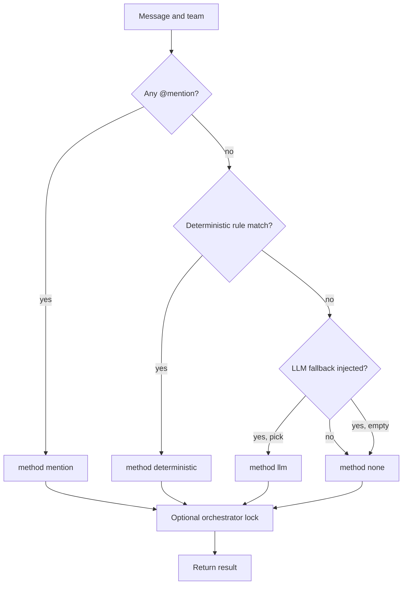

# rivulet-dispatch

A small, testable dispatcher for multi-agent chat. Mentions win. Deterministic rules run next. An injected LLM fallback runs only when nothing matched. Loop guards and a one-specialist orchestrator lock sit on top so the roster cannot talk itself in circles.

This is the routing core extracted from [Rivulets](https://github.com/jwilson411/Rivulets). Zero dependencies. No SQLAlchemy. No model vendor. You pass a message and a team. You get back who should speak, and how that decision was made.

## Why this exists

Agent *products* are crowded. The failure mode that actually costs money is unsolicited rematch: Coder replies, Writer's keyword fires, Writer replies, Coder fires again. Rivulets already had to solve that. This library is that solution without the rest of the product.

## Install

```bash
pip install rivulet-dispatch
```

From a clone:

```bash
pip install -e ".[dev]"
make test
```

## Dispatch order

1. `@mentions` bypass every rule.
2. Deterministic rules: keyword, regex, semantic (substring today), `always`. An invalid regex rule is treated as no-match and does not fail the rest of the roster.
3. Optional LLM fallback, injected as a callable. If you do not inject one, unmatched messages return `none`.
4. Optional orchestrator lock: human turns go to `Assistant`. A specialist reply bounces back to Assistant. Assistant's own reply does not rematch. Mentions still win.



On an agent-originated re-dispatch, pass `speaker_id`. The speaker cannot match themselves via `always` / keyword / LLM. Mentions still can.

`always` is a human-turn rule. It is not a license to bounce on every teammate reply.

## Broad regex probes

`is_overly_broad_regex` is a lint, not a dispatch filter. A regex rule still matches at runtime even if this helper would flag it. Call the helper when you generate or review a pattern.

The check compiles the pattern, then treats it as a catch-all if it matches the empty string or any of these five probes (the same tuple as `_BROAD_REGEX_PROBES` in `rules.py`):

| Probe | Why it is here |
|---|---|
| `xqzplm wibble-frob 9f3k` | Nonsense that still has a word-plus-digit pair. Writer's `(?i)(\d{5}-\d{4}\|[a-zA-Z]{2,}\s?\d{1,3})` hits `frob 9`. |
| `How are you all doing today?` | Ordinary greeting. A specialist that claims this is not a specialist. |
| `ok thanks` | Short ack. Same problem. |
| `hello` | Single common word. |
| `yes` | Single common word. Even shorter. |

`.*` fails the empty-string check before the probes run. `ORD-\d+` and `https?://[^\s]+` pass. An invalid regex returns false; use `is_valid_regex` for that.

If you change the tuple in `rules.py`, change this table.

## Quick example

```python
import asyncio
from rivulet_dispatch import (
    AgentDispatchInfo,
    DispatchEngine,
    DispatchMethod,
    Rule,
    RuleType,
    apply_orchestrator_lock,
)

dba = AgentDispatchInfo(
    agent_id="dba-1",
    name="DBA",
    rules=[Rule(RuleType.KEYWORD, ["postgresql", "schema"], priority=10)],
)
assistant = AgentDispatchInfo(
    agent_id="asst-1",
    name="Assistant",
    rules=[Rule(RuleType.ALWAYS)],
)

async def main() -> None:
    engine = DispatchEngine()
    raw = await engine.dispatch(
        "I need a postgresql schema for user profiles.",
        [assistant, dba],
    )
    locked = apply_orchestrator_lock(
        raw,
        from_agent_id=None,
        orchestrator_id="asst-1",
    )
    assert locked.method is DispatchMethod.DEFAULT
    assert locked.agent_ids == ["asst-1"]

asyncio.run(main())
```

A human just spoke. The lock sends it to Assistant even though DBA's keyword also matched. Assistant hands off. Keyword rematch does not pile the rest of the roster on.

No event loop handy? `dispatch_sync` wraps the same engine for CLI scripts and notebooks (not for code already inside a running loop):

```python
from rivulet_dispatch import AgentDispatchInfo, DispatchMethod, Rule, RuleType, dispatch_sync
print(dispatch_sync("postgresql schema", [AgentDispatchInfo("dba-1", "DBA", [Rule(RuleType.KEYWORD, ["postgresql"])])]).method)
```

As a shell one-liner:

```bash
python -c 'from rivulet_dispatch import AgentDispatchInfo, DispatchMethod, Rule, RuleType, dispatch_sync; print(dispatch_sync("postgresql schema", [AgentDispatchInfo("dba-1", "DBA", [Rule(RuleType.KEYWORD, ["postgresql"])])]).method)'
```

Prints `deterministic`.

## CLI

```bash
rivulet-dispatch \
  --message "I need a postgresql schema" \
  --team examples/team.json
```

```json
{"agent_ids": ["dba-1"], "method": "deterministic", "llm_invoked": false}
```

`--orchestrator Assistant` applies the one-specialist lock. `--speaker-id dba-1` is a re-dispatch of that agent's own reply. `--pretty` prints indented JSON; the default stays one compact line.

The shape of the team file is described by the JSON Schema at `examples/team.schema.json`.

The repo also ships `examples/team-no-assistant.json` (no always/Assistant agent) and `examples/team-mention-only.json` (a mention-only roster) for trying out unmatched and mention-only dispatch.

## Guards

In-memory turn cap, cycle detection, and timeout. A human message resets the counters.

```python
from rivulet_dispatch import LoopGuard

guard = LoopGuard(turn_limit=10, cycle_window=8, cycle_threshold=3)
pause = guard.record_agent_message(from_agent_id="a", to_agent_id="b")
# pause is None until a limit trips, then Pause(reason=..., message=...)
guard.reset()  # human spoke
```

Cycle detection counts repeating `(from, to)` pairs inside the window. Default threshold is 3. See `examples/loop.py` for a runnable demo that trips the cycle detector.

## What this is not

- Not a chat product. Rivulets is the product.
- Not an LLM client. The fallback is an injected callable so you can use anything, or nothing.
- Not a copy of the Rivulets HTTP service, database, or AgentOS wiring.

## License

MIT for this library. Rivulets itself remains BUSL 1.1.
